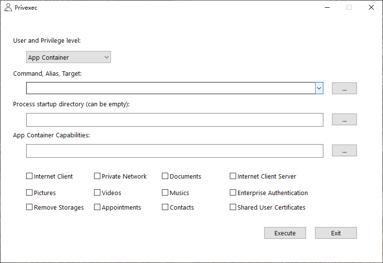

# Privexec

[](https://ci.appveyor.com/project/fcharlie/privexec/branch/master)

Run the program with the specified permission level

## Alias

If you want add a alias to Privexec, Please modify Privexec.json on your Privexec.exe location.

```json
{
    "Alias": [
        {
            "Desc": "Edit Hosts",
            "Alias": "edithosts",
            "Target": "Notepad %windir%\\System32\\Drivers\\etc\\hosts"
        },
        {
            "Desc": "PowerShell",
            "Alias": "pwsh",
            "Target": "powershell"
        },
        {
            "Desc": "PowerShell ISE",
            "Alias": "pwshise",
            "Target": "powershell_ise"
        },
        {
            "Desc": "Windows Debugger",
            "Alias": "windbg",
            "Target": "\"%ProgramFiles(x86)%\\Windows Kits\\10\\Debuggers\\x64\\windbg.exe\""
        }
    ]
}
```

wsudo alias ? working in progress


## Screenshot


Alias:


AppContainer:



**wsudo**:

wsudo run under CMD:


wsudo run under Git for Windows Bash:


wsudo Verbose Mode:


## Usage

Privexec is a GUI client, Your can run as administrator (no administrator), System and TrustedInstaller require administrator!!!

Command and Process startup directory support `ExpandEnvironmentString`.

wsudo is a console command client

**wsudo usage:**

```txt
wsudo ♥ run the program with the specified permissions
usage: wsudo command args....
   -v|--version        print version and exit
   -h|--help           print help information and exit
   -u|--user           run as user (optional), support '-uX', '-u X', '--user=X', '--user X'
                       Supported user categories (Ignore case):
                       AppContainer  MIC
                       NoElevated    Administrator
                       System        TrustedInstaller

   -n|--new-console    Starts a separate window to run a specified program or command.
   -w|--wait           Start application and wait for it to terminate.
   -V|--verbose        Make the operation more talkative
   -x|--appx           AppContainer AppManifest file path
   -c|--cwd            Use a working directory to launch the process.
   --disable-alias     Disable Privexec alias, By default, if Privexec exists alias, use it.

Select user can use the following flags:
   -a          AppContainer
   -M          Mandatory Integrity Control
   -U          No Elevated(UAC)
   -A          Administrator
   -S          System
   -T          TrustedInstaller
Example:
   wsudo -A "%SYSTEMROOT%/System32/WindowsPowerShell/v1.0/powershell.exe" -NoProfile
   wsudo -T cmd

Builtin 'alias' command:
   wsudo alias add ehs "notepad %SYSTEMROOT%/System32/drivers/etc/hosts" "Edit Hosts"
   wsudo alias delete ehs


```

## WSUDO Details

wsudo support `--new-console` flag. when a PE subsystem is `WINDOWS CUI`, wsudo will wait child process exit, unless wsudo(administrator) start `NoElevated` process or wsudo(No Elevated) start `Elevated` process. If you add `--new-console` flag, will create new console and not wait.

If your add `-wait` flag, wsudo will wait all process(Include GUI/CUI process), Unless process use `TaskScheduled API` startup.


## Download

Download CI Build:
[https://ci.appveyor.com/project/fcharlie/privexec/build/artifacts](https://ci.appveyor.com/project/fcharlie/privexec/build/artifacts)

## LICENSE

This project use MIT License, and JSON use [https://github.com/nlohmann/json](https://github.com/nlohmann/json) , some API use NSudo, but rewrite it.
