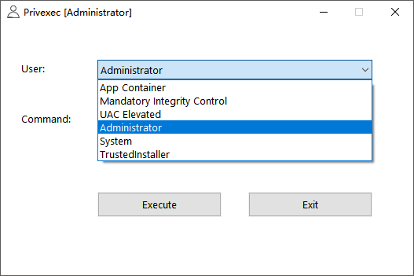
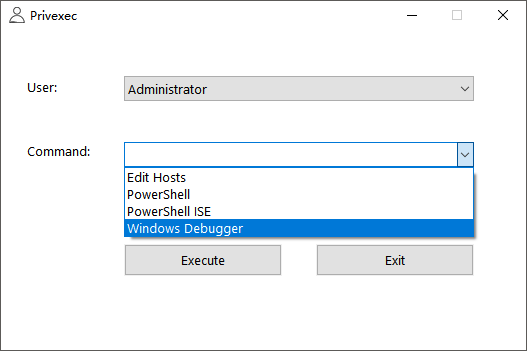
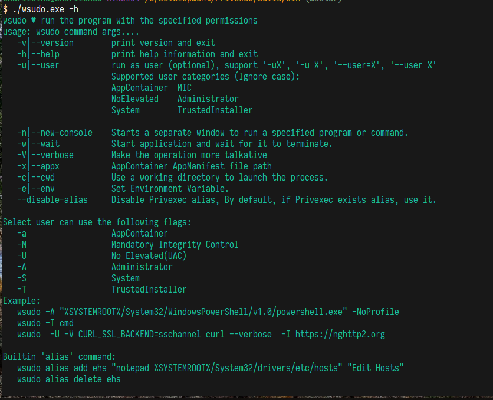
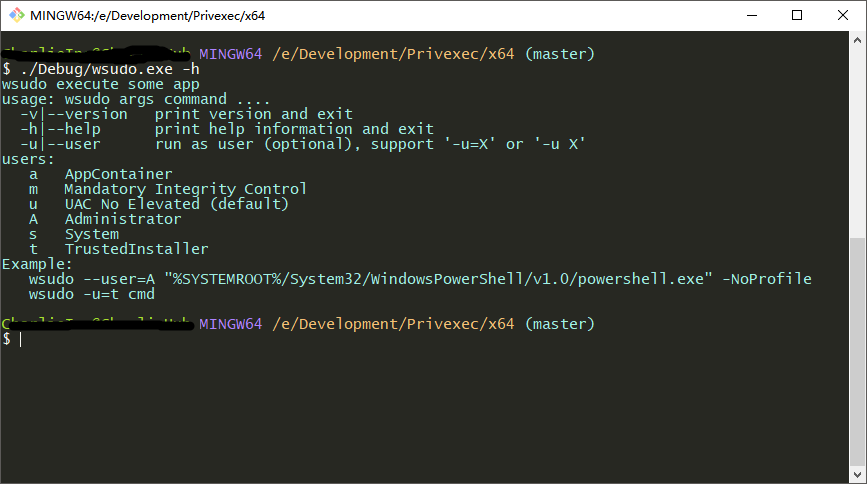
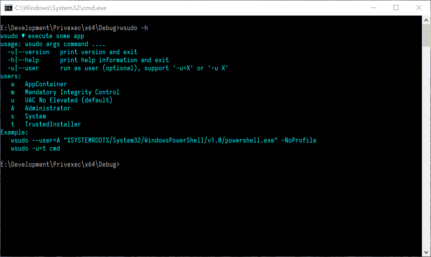

# Privexec

[](https://ci.appveyor.com/project/fcharlie/privexec/branch/master)

Execute some command

## Alias

If you want add a alias to Privexec, Please modify Privexec.json on your Privexec.exe location.

```json
{
    "Alias": [
        {
            "Name": "Edit Hosts",
            "Command": "Notepad %windir%\\System32\\Drivers\\etc\\hosts"
        },
        {
            "Name": "PowerShell",
            "Command": "powershell"
        },
        {
            "Name": "PowerShell ISE",
            "Command": "powershell_ise"
        },
        {
            "Name": "Windows Debugger",
            "Command": "\"%ProgramFiles(x86)%\\Windows Kits\\10\\Debuggers\\x64\\windbg.exe\""
        }
    ]
}
```

wsudo alias ? working in progress


## Screenshot




Alias:



wsudo:







## Usage

Privexec is a GUI client, Your can run as administrator (no administrator), System and TrustedInstaller require administrator!!!

wsudo is a console command client

**wsudo usage:**

```txt
wsudo ♥ execute some app
usage: wsudo command args....
  -v|--version   print version and exit
  -h|--help      print help information and exit
  -u|--user      run as user (optional), support '-u=X' or '-u X'
users:
   a   AppContainer
   m   Mandatory Integrity Control
   u   UAC No Elevated (default)
   A   Administrator
   s   System
   t   TrustedInstaller
Example:
   wsudo --user=A "%SYSTEMROOT%/System32/WindowsPowerShell/v1.0/powershell.exe" -NoProfile
   wsudo -u=t cmd
```

## Download

Download CI Build:
[https://ci.appveyor.com/project/fcharlie/privexec/build/artifacts](https://ci.appveyor.com/project/fcharlie/privexec/build/artifacts)

## LICENSE

This project use MIT License, and JSON use [https://github.com/nlohmann/json](https://github.com/nlohmann/json) , some API use NSudo.
