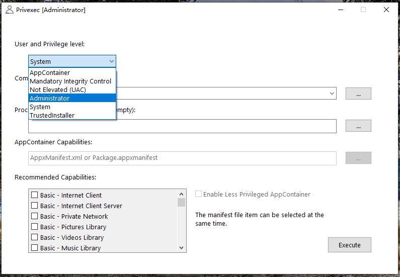
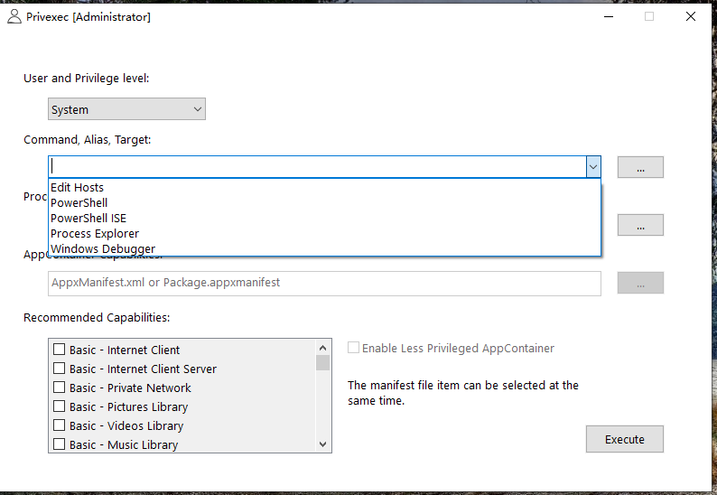
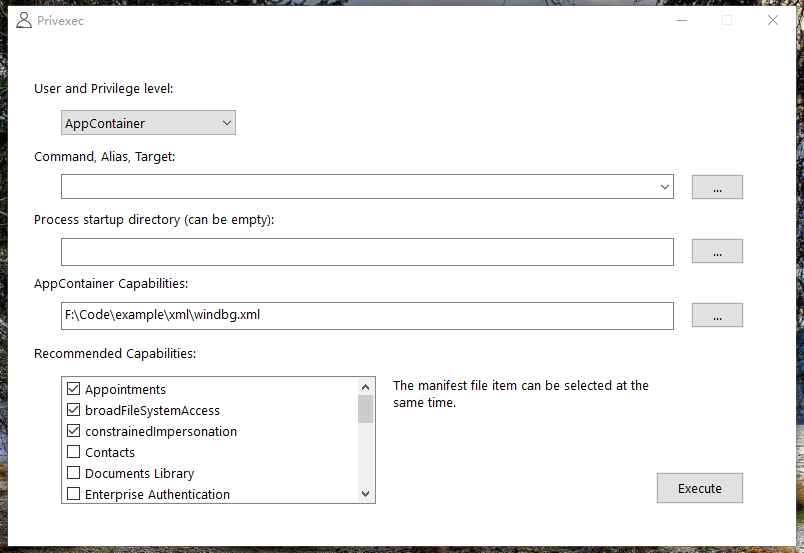
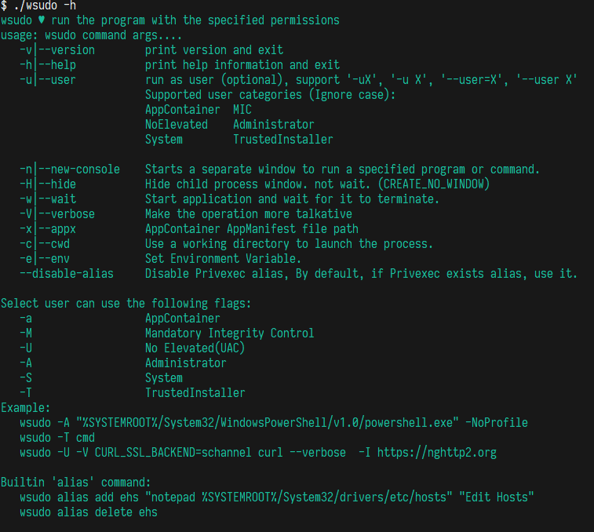
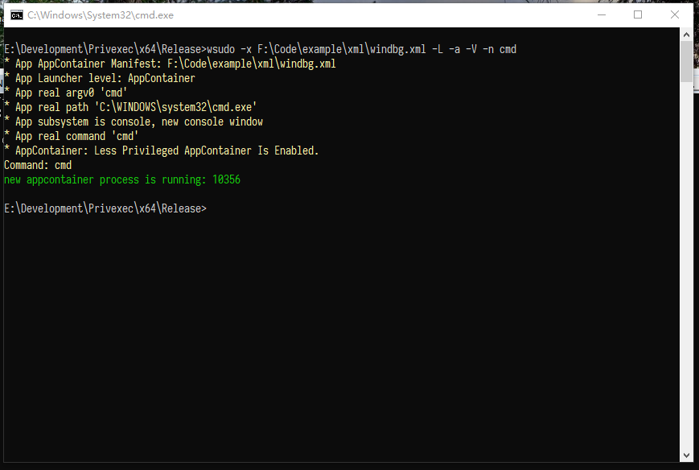
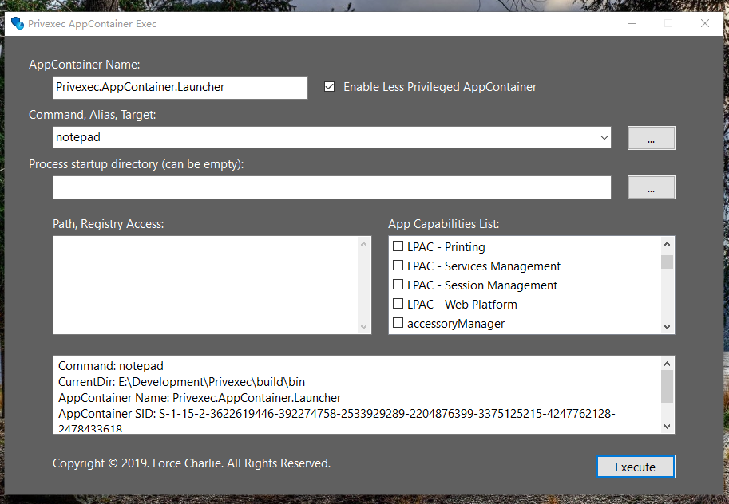

# Privexec


[](LICENSE)
[](https://ci.appveyor.com/project/fcharlie/privexec/branch/master)
[](https://996.icu)


Run the program with the specified permission level

## Alias

If you want add a alias to Privexec, Please modify Privexec.json on your Privexec.exe location.

```json
{
    "Alias": [
        {
            "Desc": "Edit Hosts",
            "Alias": "edithosts",
            "Target": "Notepad %windir%\\System32\\Drivers\\etc\\hosts"
        },
        {
            "Desc": "PowerShell",
            "Alias": "pwsh",
            "Target": "powershell"
        },
        {
            "Desc": "PowerShell ISE",
            "Alias": "pwshise",
            "Target": "powershell_ise"
        },
        {
            "Desc": "Windows Debugger",
            "Alias": "windbg",
            "Target": "\"%ProgramFiles(x86)%\\Windows Kits\\10\\Debuggers\\x64\\windbg.exe\""
        }
    ]
}
```


## Screenshot




Alias:



AppContainer:



**wsudo**:


wsudo usage:



wsudo Verbose Mode:



AppContainer Exec



## Usage

Privexec is a GUI client, Your can run as administrator (no administrator), System and TrustedInstaller require administrator!!!

Command and Process startup directory support `ExpandEnvironmentString`.

wsudo is a console command client

**wsudo usage:**

```txt
wsudo 😋 ♥ run the program with the specified permissions
usage: wsudo command args...
   -v|--version        print version and exit
   -h|--help           print help information and exit
   -u|--user           run as user (optional), support '-uX', '-u X', '--user=X', '--user X'
                       Supported user categories (Ignore case):
                       AppContainer    MIC       NoElevated
                       Administrator   System    TrustedInstaller

   -n|--new-console    Starts a separate window to run a specified program or command.
   -H|--hide           Hide child process window. not wait. (CREATE_NO_WINDOW)
   -w|--wait           Start application and wait for it to terminate.
   -V|--verbose        Make the operation more talkative
   -x|--appx           AppContainer AppManifest file path
   -c|--cwd            Use a working directory to launch the process.
   -e|--env            Set Environment Variable.
   -L|--lpac           Less Privileged AppContainer mode.
   --disable-alias     Disable Privexec alias, By default, if Privexec exists alias, use it.
   --appname           Set AppContainer Name

Select user can use the following flags:
   |-a  AppContainer    |-M  Mandatory Integrity Control|-U  No Elevated(UAC)|
   |-A  Administrator   |-S  System                     |-T  TrustedInstaller|
Example:
   wsudo -A "%SYSTEMROOT%/System32/WindowsPowerShell/v1.0/powershell.exe" -NoProfile
   wsudo -T cmd
   wsudo -U -V --env CURL_SSL_BACKEND=schannel curl --verbose  -I https://nghttp2.org

Builtin 'alias' command:
   wsudo alias add ehs "notepad %SYSTEMROOT%/System32/drivers/etc/hosts" "Edit Hosts"
   wsudo alias delete ehs

```

## WSUDO Details

The wsudo visible and wait related parameters are `--hide` `--wait` `--new-console`. The corresponding situation is as follows:

|PE Subsystem|`No relevant parameters`|`--new-console`|`--hide`|
|---|---|---|---
|Windows CUI|wait/Inheritance console|no wait/New console|no wait/No console|
|Windows GUI|no wait/New UI|no wait/New UI|no wait/ignore|
|Windows CUI `-wait`|wait/Inheritance console|wait/New console|wait/No console|
|Windows GUI `-wait`|wait/New UI|wait/New UI|wait/No ignore|

### WSUDO Environment

wsudo support `-e/--env` to set environment. such as:

```batch
::curl must enabled multiple SSL backends.
wsudo  -U -V --env CURL_SSL_BACKEND=schannel curl --verbose  -I https://nghttp2.org
```

Environment variables are deduced in cmd, so be careful to use quotes. In powershell, the environment variable format is different, and wsudo will eventually process the environment variable.

```powershell
# powershell
.\bin\wsudo.exe -n -e 'PATH=%PATH%;%TEMP%' -U cmd
```

```batch
::cmd
wsudo -e "PATH=%PATH%;%TEMP%" -n -U cmd
```


## Download

Download CI Build:
[https://ci.appveyor.com/project/fcharlie/privexec/branch/master/artifacts](https://ci.appveyor.com/project/fcharlie/privexec/branch/master/artifacts)


## Changelog

see: [changelog.md](./docs/changelog.md)

## LICENSE

This project use MIT License, and JSON use [https://github.com/nlohmann/json](https://github.com/nlohmann/json) , some API use NSudo, but rewrite it.
