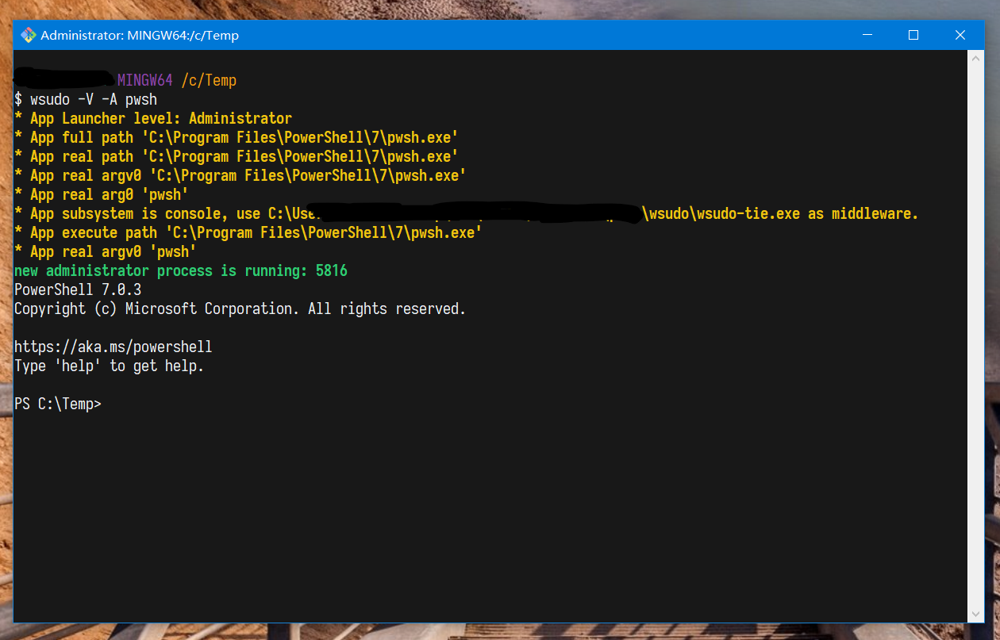

# Privexec

[](LICENSE)
[](https://github.com/M2Team/Privexec/actions)
[](https://github.com/M2Team/Privexec/releases/latest)
[](https://github.com/M2Team/Privexec/releases)
[](https://996.icu)


[简体中文](./ReadMe.zh-CN.md)

Run the program with the specified permission level

## Install

Install Privexec by [baulk](https://github.com/baulk/baulk)

```powershell
baulk install wsudo
wsudo --version
```

Or you can download it directly, use Exeplorer or 7z and other tools to extract and then use Privexec, download link: [https://github.com/M2Team/Privexec/releases/latest](https://github.com/M2Team/Privexec/releases/latest)


## Alias
Privexec and wsudo can resolve aliases. In addition, wsudo adds or deletes aliases. It is also a good choice to use vscode to edit `Privexec.json` to modify aliases. When Privexec is installed via baulk, the storage directory of `Privexec.json` is `$BAULK_ROOT/bin/etc`. If Privexec Download and unzip directly, then `Privexec.json` will be in the same directory as `Privexec.exe`.


```json
{
    "alias": [
        {
            "description": "Edit Hosts",
            "name": "edit-hosts",
            "target": "Notepad %windir%\\System32\\Drivers\\etc\\hosts"
        },
        {
            "description": "Windows Debugger",
            "name": "windbg",
            "target": "\"%ProgramFiles(x86)%\\Windows Kits\\10\\Debuggers\\x64\\windbg.exe\""
        }
    ]
}
```


## Screenshot


Alias:


AppContainer:


wsudo usage:


wsudo Verbose Mode:


AppContainer Exec


## Usage

Privexec is a GUI client. When running as a standard user, you can start the administrator process; when running as an administrator, you can elevate the privileges to `System` or `TrustedInstaller`. It should be noted that `System` or `TrustedInstaller` has too many privileges, which can easily damage the system operation. Be careful when using it.

AppExec is a program that starts the AppContainer process. Some developers use this program to study the running details of Windows AppContainer and the vulnerabilities of AppContaner. UWP applications run in the AppContainer container.

wsudo is the console version of Privexec/AppExec. The detailed help is as follows:

**wsudo usage:**

```txt
wsudo 😋 ♥ run the program with the specified permissions
usage: wsudo command args...
   -v|--version        print version and exit
   -h|--help           print help information and exit
   -u|--user           run as user (optional), support '-uX', '-u X', '--user=X', '--user X'
                       Supported user categories (Ignore case):
                       AppContainer    MIC       NoElevated
                       Administrator   System    TrustedInstaller

   -n|--new-console    Starts a separate window to run a specified program or command.
   -H|--hide           Hide child process window. not wait. (CREATE_NO_WINDOW)
   -w|--wait           Start application and wait for it to terminate.
   -V|--verbose        Make the operation more talkative
   -x|--appx           AppContainer AppManifest file path
   -c|--cwd            Use a working directory to launch the process.
   -e|--env            Set Environment Variable.
   -L|--lpac           Less Privileged AppContainer mode.
   --disable-alias     Disable Privexec alias, By default, if Privexec exists alias, use it.
   --appname           Set AppContainer Name

Select user can use the following flags:
   |-a  AppContainer    |-M  Mandatory Integrity Control|-U  No Elevated(UAC)|
   |-A  Administrator   |-S  System                     |-T  TrustedInstaller|
Example:
   wsudo -A "%SYSTEMROOT%/System32/WindowsPowerShell/v1.0/powershell.exe" -NoProfile
   wsudo -T cmd
   wsudo -U -V --env CURL_SSL_BACKEND=schannel curl --verbose  -I https://nghttp2.org

Builtin 'alias' command:
   wsudo alias add ehs "notepad %SYSTEMROOT%/System32/drivers/etc/hosts" "Edit Hosts"
   wsudo alias delete ehs

```

When Privexec, AppExec, wsudo launch commands, the command line and launch directory support deduction via `ExpandEnvironmentString`.


## WSUDO Details

The wsudo visible and wait related parameters are `--hide` `--wait` `--new-console`. The corresponding situation is as follows:

|PE Subsystem|`No relevant parameters`|`--new-console`|`--hide`|
|---|---|---|---
|Windows CUI|wait/Inheritance console|no wait/New console|no wait/No console|
|Windows GUI|no wait/New UI|no wait/New UI|no wait/ignore|
|Windows CUI `-wait`|wait/Inheritance console|wait/New console|wait/No console|
|Windows GUI `-wait`|wait/New UI|wait/New UI|wait/No ignore|

When wsudo starts the administrator process as a standard user, if it is currently running in the console, it supports inheriting the console window. If it is not running in the console, it can do nothing. The newer Cygwin currently supports the newer Windows 10 `ConPty` starts the console, so it can inherit the console window, which is the terminal. The picture below is the proof.

wsudo exec administrator process under mintty (Turn on ConPty):



### WSUDO Environment

wsudo support `-e/--env` to set environment. such as:

```batch
::curl must enabled multiple SSL backends.
wsudo  -U -V --env CURL_SSL_BACKEND=schannel curl --verbose  -I https://nghttp2.org
```
The environment variables will be deduced according to the Batch mechanism, that is, the environment variables are marked with matching `%`.

```powershell
# powershell
.\bin\wsudo.exe -n -e 'PATH=%PATH%;%TEMP%' -U cmd
```

```batch
::cmd
wsudo -e "PATH=%PATH%;%TEMP%" -n -U cmd
```

## Changelog

see: [changelog.md](./docs/changelog.md)

## LICENSE

This project use MIT License, and JSON use [https://github.com/nlohmann/json](https://github.com/nlohmann/json) , some API use NSudo, but rewrite it.